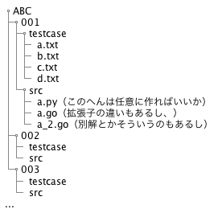

## 目的
atcoderの練習用にコード書く用ファイルとテストケースのテキストを生成したい

とりあえずABCしか考えてない

## 内容
ABCはほぼ毎週増えているので最終的にはcronでどこまで増えているかとってきて、まだなかったらフォルダ作成、としたい

cronに投げるのはあとでいいのでとりあえずpythonからrunすりゃ一発で作れるようにする。argsもあとでいいのでとりあえずコード内にパス直書き

狙ったパスにABCフォルダを作り、その中に001, 002, ...といったサブフォルダを作る

サブフォルダの中にa.txt, b.txt, c.txt, d.txtを作る。これがテストケースになる。今の使い方だとブラウザ開いてやってて、基本的に`python a.py < a.txt`して標準出力とブラウザに表示されてるテストケースの答えを目視して確認してる。とりあえずこれでいい

テストケースのテキストファイルにはちゃんとテストケースを引っ張って貼り付けることにする。今の使い方だといちいちブラウザからコピペして別のテストケースに手動で切り替えている。とりあえず最初に出てくるテストケースだけでいい
